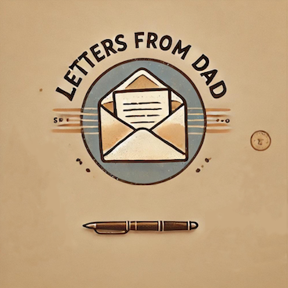

Hi kids, 

Here it is. The first letter of a series of letters that I plan to write to you.

Why am I doing this: 
Over the years I couldn’t help but recognize all sorts of things that I would have loved to know growing up, but weren’t taught in school. 
At some point I started to take notes every time I understood something that I found interesting or helpful. Initially I never really considered to do anything with them.

But when you showed up everything changed. 


As you are still young and it’s uncertain if I can share these lessons in person when the time has come, I’ve decided to write them down.

Frankly, I don’t think that you will follow or apply most of the advice and that is ok. 
Life is about making your own mistakes and learning from them. But if even only 5% of this is going to be useful to you, it is still a win. :)

I will try and keep the letters rather short so that you can read them quickly. My goal is to try to get to behind the why of things and give actionable advice, while not being boring. You might think: Good luck with that - but hey, it’s worth a try.

I’ll write them in a somewhat organized manner, but it still should work to jump back and forth as they won’t build too much onto each other. 

A good age to start reading these might be when you enter puberty, so the age when you prefer reading from me rather than talking to me anyways (lol). 

Alright, let’s get started before I risk losing your attention due to even more dad jokes. 
Off to letter number 01.

Love you, 
Dad

----------------------------------------------------------------------------------------------------------------------------------------------------------------

Letter 01

WHAT DO YOU REALLY WANT (NO, REALLY!)


Hi kids,



Today I am going to write about “What Do You Really Want? (No, Really!)”. 

Reading the title you might think: That’s easy, I want ice cream! 
But trust me, sometimes it’s easy and sometimes it is trickier to find out what you really want. No, really! 😉 

Let me explain:



THE WORLD AND YOU

Here's the thing: we're all influenced by the world around us. Your friends, family, social media, even those sneaky ads – they're all telling you what you should want. Sometimes that makes us try to be all things to all people. But are those things really what you want?


Let's play a little game: Think about something you really want right now. Got it? Okay, now ask yourself: "Why do I want this?" Keep asking "Why?" until you can't go any further. You might be surprised where you end up!



PEELING BACK THE LAYERS

Sometimes, what we think we want is just the wrapping paper. We need to tear it off to find the real gift inside. 
For example: You might say, "I want to be rich!" But why? "So I can buy whatever I want." Okay, but why? "So I need not to worry about money." Ah, now we're getting somewhere!


See what happened? You started with "being rich" but ended up at “not needing to worry”. Those are the real desires hiding underneath. All it took is asking “why” a couple of times.



BEING TRUE TO YOU

Now comes the tricky part: being honest with yourself about what you really want. It's not always easy, especially if it's different from what others expect. Even I still find this hard sometimes!


Imagine this: Your friends are all super excited about joining the hockey team. They keep talking about how awesome it'll be if you all play together. But deep down, you'd rather join the chess club instead.


It takes guts to say, "Actually, I think I want to try something different." But that's what being true to yourself is all about. It's about listening to that little voice inside you, even when it's saying something unexpected.

 To stand out due to wanting something different can be hard sometimes. But remember to be “outstanding” can be something good as well!

Generally, there's no "right" or "wrong" when it comes to what you want. The only mistake is pretending to want something just because you think that's what you're supposed to want.



HOW TO FIGURE IT OUT


So, how do you uncover your true desires? Here are some tricks:

1. Write things down. It will help you to think clearly.
2. Pay attention to what excites you. What makes you lose track of time?
3. Notice your daydreams. What do you imagine when your mind wanders?
4. Think about your dreams when you were little. Sometimes our younger selves knew what we really wanted before the world told us otherwise.
5. And maybe most importantly: Try new things! You might discover desires you never knew you had.



WHY IT MATTERS


Knowing what you truly want is like having a compass for your life. It helps you make decisions that align with your authentic self. And when you're living authentically? That's when life gets really good.

But here's the plot twist: What you want can change over time, and that's okay! The important thing is to keep checking in with yourself. 

Only be beware of shiny new things, they can distract you away from what you really want. When you think about switching course maybe a bit too quickly, it’s important to slow down.
 Take some time to write and think. 
What do YOU want? Not what you think you should want, or what others want for you, but what lights YOU up inside? Have confidence in your gut feeling.


It might take some soul-searching, but I promise it's worth it. After all, it's your life – shouldn't you be the one deciding what you want from it?


Love, Dad


P.S. If you figure out what you really want is a pet dragon, let me know. We might need to have another talk about reality vs. fantasy! 😄
