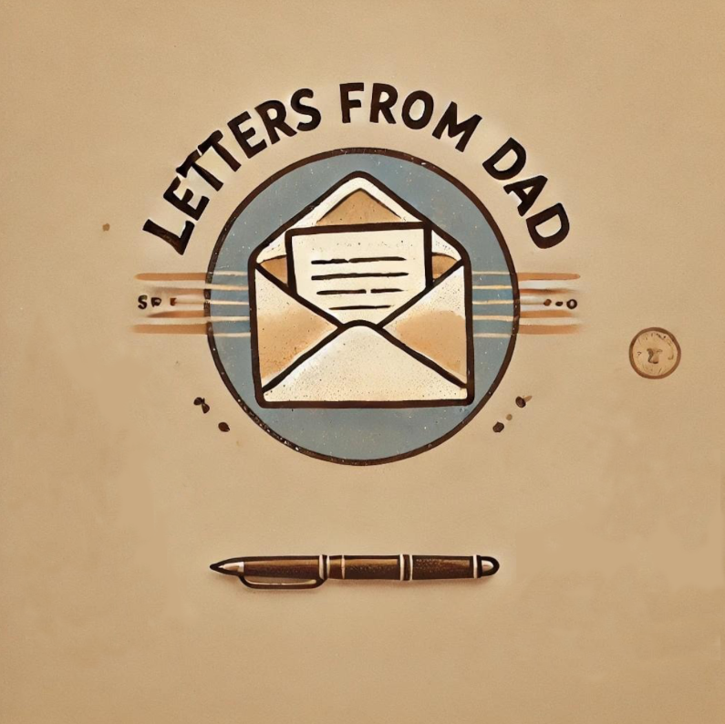

Hi kids, 

Here it is. The first letter of a series of letters that I plan to write to you.

Why am I doing this: 
Over the years I couldn’t help but recognize all sorts of things that I would have loved to know growing up, but weren’t taught in school. 
At some point I started to take notes every time I understood something that I found interesting or helpful. Initially I never really considered to do anything with them.

But when you showed up everything changed. 


As you are still young and it’s uncertain if I can share these lessons in person when the time has come, I’ve decided to write them down.

Frankly, I don’t think that you will follow or apply most of the advice and that is ok. 
Life is about making your own mistakes and learning from them. But if even only 5% of this is going to be useful to you, it is still a win. :)

I will try and keep the letters rather short so that you can read them quickly. My goal is to try to get to behind the why of things and give actionable advice, while not being boring. You might think: Good luck with that - but hey, it’s worth a try.

I’ll write them in a somewhat organized manner, but it still should work to jump back and forth as they won’t build too much onto each other. 

A good age to start reading these might be when you enter puberty, so the age when you prefer reading from me rather than talking to me anyways (lol). 

Alright, let’s get started before I risk losing your attention due to even more dad jokes. 
Off to letter number 01.

Love you, 
Dad

